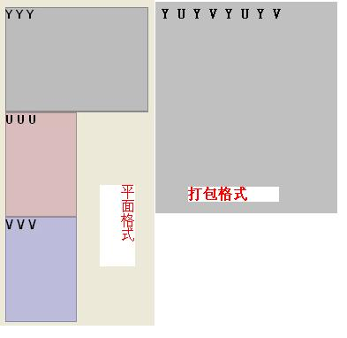

# YUV格式&像素

一幅彩色图像的基本要素是什么？

说白了，一幅图像包括的基本东西就是二进制数据，其容量大小实质即为二进制数据的多少。一幅1920 * 1080像素的YUV422的图像，大小是1920 * 1080 * 2=4147200（十进制），也就是3.95M大小。这个大小跟多少个像素点和数据的存储格式有关。下面简述yuv与像素的关系：

YUV与像素的关系：

YUV是利用一个亮度（Y）、两个色差(U,V)来代替传统的RGB三原色来压缩图像。传统的RGB三原色使用红绿蓝三原色表示一个像素，每种原色占用一个字节（8 bit），因此一个像素用RGB表示则需要8 * 3=24 bit。如果使用YUV表示这个像素，假设YUV的采样率为: 4: 2: 0，即每一个像素对于亮度Y的采样频率为1，对于色差U和V，则是每相邻的两个像素各取一个U和V。对于单个的像素来说，色差U和V的采样频率为亮度的一半。如有三个相邻的像素，如果用RGB三原色表示，则共需要占用：8 * 3 * 3=72 bits；如果采用YUV（4: 2: 0）表示，则只需要占用：8 * 3（Y）+ 8 * 3 * 0.5（U）+8 * 3 * 0.5（V）= 36 bits。只需原来一半的空间，就可以表示原来的图像，数据率压缩了一倍，而图像的效果基本没发生变化。

一般描述一幅图像的参数时会考虑以下几点：

1、宽：一行有多少个像素点。2、高：一列有多少个像素点。3、YUV格式还是RGB格式？4、一行多少个字节？5、图像大小是多少？6、图像的分辨率是多少？

以下对YUV422、YUV420和YUV444进行初步解析：

**YUV422格式。**

分为很多小类，按照U、V的排列可以有YUYV,YVYU,UYVY,VYUY四种，其中，YUYVY一般又称作yuv2格式。

而这四种**YUV422格式**，每种又可以分为2小类，按Y和UV的排列可以有打包格式和平面格式。例如，一个640×480×2的YUV文件，打包格式就是YUYVYUYV这样一直排列下去，平面格式就是先640×480个Y排列完，然后是640×240个U，然后是640×240个V这样排列，如下

图：

假如有一幅640×480的图片，用yuv422来表示，那么，采样方式就是每个像素采样Y信号，U,V信号隔一个采样，这样算下来，就有640×480个Y,640×240个U,640×240个V，一幅640×480大小的YUV图片占的总字节数为640×480×2个字节，每像素2个字节，也就是16位。

在内存种中这样排列：Y0U0Y1V0 Y2U1Y3V1...

第一个像素的YUV值为：Y0 U0 V0

第二个像素的YUV值为： Y1 U0 V0

第三个像素的YUV值为： Y2 U1 V1

.....其他以此推类，也就是说每两个像素是共用了UV的；在一行上来看，每个像素的YUV值中Y值被采样，UV值采样0后，跳到3，然后5，所以每行上Y有640个，U,V各320个。

主要的采样格式有YCbCr 4: 2: 0、YCbCr 4: 2: 2、YCbCr 4: 1: 1和 YCbCr 4: 4: 4。其中YCbCr 4: 1: 1 比较常用，其含义为：每个点保存一个 8 bit 的亮度值(也就是Y值), 每 2 * 2 个点保存一个 Cr 和Cb 值, 图像在肉眼中的感觉不会起太大的变化。所以, 原来用 RGB(R,G,B 都是 8 bit unsigned) 模型, 4 个点需要 8 * 3=24 bites（如下图第一个图）. 而现在仅需要 8+(8/4)+(8/4)=12 bites, 平均每个点占12 bites，这样就把图像的数据压缩了一半。

以上仅给出了理论上的示例，在实际数据存储中是有可能是不同的，下面给出几种具体的存储形式：

（1） YUV 4: 4: 4

YUV三个信道的抽样率相同，因此在生成的图像里，每个象素的三个分量信息完整（每个分量通常8比特），经过8比特量化之后，未经压缩的每个像素占用3个字节。

下面的四个像素为: [Y0 U0 V0] [Y1 U1 V1] [Y2 U2 V2] [Y3 U3 V3]

存放的码流为: Y0 U0 V0 Y1 U1 V1 Y2 U2 V2 Y3 U3 V3

（2） YUV 4: 2: 2

每个色差信道的抽样率是亮度信道的一半，所以**水平方向**的色度抽样率只是4: 4: 4的一半。对非压缩的8比特量化的图像来说，每个由两个水平方向相邻的像素组成的宏像素需要占用4字节内存**（亮度2个字节,两个色度各1个字节）。**。

下面的四个像素为: **[Y0 U0 V0] [Y1 U1 V1]** [Y2 U2 V2] [Y3 U3 V3]

存放的码流为: **Y0 U0 Y1 V1** Y2 U2 Y3 V3

映射出像素点为：[Y0 U0 V1] [Y1 U0 V1] [Y2 U2 V3] [Y3 U2 V3]

（3） YUV 4: 1: 1

4: 1: 1的色度抽样，是在**水平方向上对色度进行4: 1抽样**。对于低端用户和消费类产品这仍然是可以接受的。对非压缩的8比特量化的视频来说，每个由4个水平方向相邻的像素组成的宏像素需要占用6字节内存**（亮度4个字节,两个色度各1个字节）。**

下面的四个像素为: **[Y0 U0 V0] [Y1 U1 V1] [Y2 U2 V2] [Y3 U3 V3]**

存放的码流为: **Y0 U0 Y1 Y2 V2 Y3**

映射出像素点为：[Y0 U0 V2] [Y1 U0 V2] [Y2 U0 V2] [Y3 U0 V2]

（4）YUV 4: 2: 0

4: 2: 0并不意味着只有Y,Cb而没有Cr分量。**它指得是对每行扫描线来说，只有一种色度分量以2: 1的抽样率存储。相邻的扫描行存储不同的色度分量**， 也就是说，如果一行是4: 2: 0的话，下一行就是4: 0: 2，再下一行是4: 2: 0...以此类推。对每个色度分量来说，水平方向和竖直方向的抽样率都是 2: 1，所以可以说色度的抽样率是4: 1。对非压缩的8比特量化的视频来说，每个由2 * 2个2行2列相邻的像素组成的宏像素需要占用6字节内存**（亮度4个字节,两个色度各1个字节）。**

下面八个像素为：**[Y0 U0 V0] [Y1 U1 V1]** [Y2 U2 V2][Y3 U3 V3]

**[Y5U5 V5] [Y6 U6 V6]** [Y7U7 V7] [Y8 U8 V8]

存放的码流为：**Y0 U0 Y1** Y2 U2 Y3

**Y5 V5 Y6** Y7 V7 Y8

映射出的像素点为：[Y0 U0 V5] [Y1 U0 V5] [Y2 U2 V7] [Y3 U2 V7]

[Y5U0 V5] [Y6 U0 V5] [Y7U2 V7] [Y8 U2 V7]