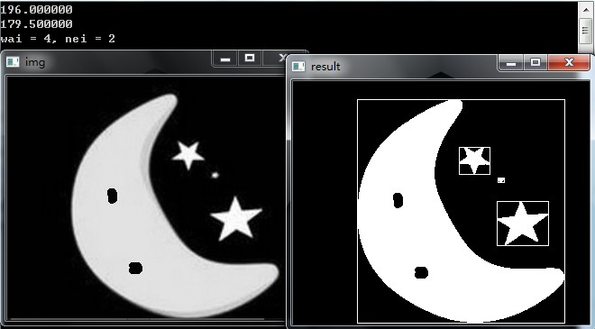
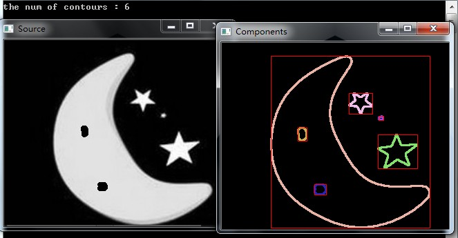
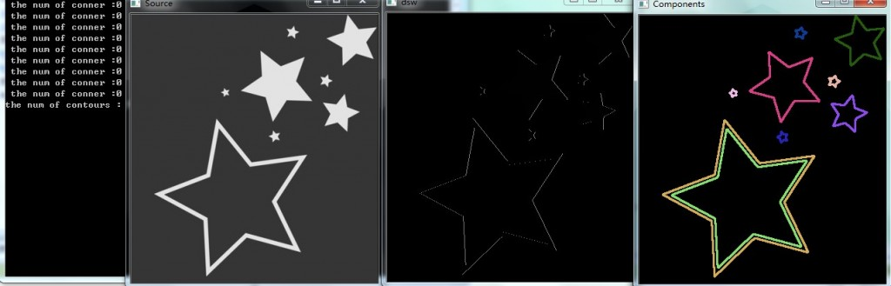
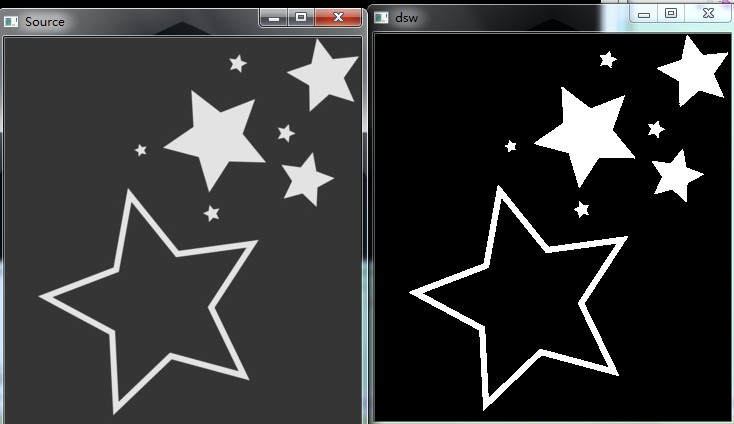

# opencv查找轮廓---cvFindContours && cvDrawCountours 用法及例子


**FindContours        在二值图像中寻找轮廓** 

```c++
int cvFindContours( CvArr* image, CvMemStorage* storage, CvSeq** first_contour,
int header_size=sizeof(CvContour), int mode=CV_RETR_LIST,
int method=CV_CHAIN_APPROX_SIMPLE, CvPoint offset=cvPoint(0,0) );
```

image 
输入的 8-比特、单通道图像. 非零元素被当成 1， 0 象素值保留为 0 - 从而图像被看成二值的。为了从灰度图像中得到这样的二值图像，可以使用 cvThreshold, cvAdaptiveThreshold 或 cvCanny. 本函数改变输入图像内容。 


storage 
得到的轮廓的存储容器 

first_contour 
输出参数：包含第一个输出轮廓的指针 


header_size 
如果 method=CV_CHAIN_CODE，则序列头的大小 >=sizeof(CvChain)，否则 >=sizeof(CvContour) . 


mode 
提取模式. 
CV_RETR_EXTERNAL - 只提取最外层的轮廓 
CV_RETR_LIST - 提取所有轮廓，并且放置在 list 中 
CV_RETR_CCOMP - 提取所有轮廓，并且将其组织为两层的 hierarchy: 顶层为连通域的外围边界，次层为洞的内层边界。 
CV_RETR_TREE - 提取所有轮廓，并且重构嵌套轮廓的全部 hierarchy 

method 
逼近方法 (对所有节点, 不包括使用内部逼近的 CV_RETR_RUNS). 
CV_CHAIN_CODE - Freeman 链码的输出轮廓. 其它方法输出多边形(定点序列). 
CV_CHAIN_APPROX_NONE - 将所有点由链码形式翻译(转化）为点序列形式 
CV_CHAIN_APPROX_SIMPLE - 压缩水平、垂直和对角分割，即函数只保留末端的象素点; 
CV_CHAIN_APPROX_TC89_L1, 
CV_CHAIN_APPROX_TC89_KCOS - 应用 Teh-Chin 链逼近算法. CV_LINK_RUNS - 通过连接为 1 的水平碎片使用完全不同的轮廓提取算法。仅有 CV_RETR_LIST 提取模式可以在本方法中应用. 


offset 
每一个轮廓点的偏移量. 当轮廓是从图像 ROI 中提取出来的时候，使用偏移量有用，因为可以从整个图像上下文来对轮廓做分析. 
函数 cvFindContours 从二值图像中提取轮廓，并且返回提取轮廓的数目。指针 first_contour 的内容由函数填写。它包含第一个最外层轮廓的指针，如果指针为 NULL，则没有检测到轮廓（比如图像是全黑的）。其它轮廓可以从 first_contour 利用 h_next 和 v_next 链接访问到。 在 cvDrawContours 的样例显示如何使用轮廓来进行连通域的检测。轮廓也可以用来做形状分析和对象识别 - 见CVPR2001 教程中的 squares 样例。该教程可以在 SourceForge 网站上找到。 

++++++++++++++++++++++++++++++++++++++++++++++++++++++++++++++++++++++++++++++++++++++++++++++++++++++++++++++++++++++++++++++++++++

DrawContours    在图像中绘制外部和内部的轮廓。 

```c++
void cvDrawContours( CvArr *img, CvSeq* contour,
                     CvScalar external_color, CvScalar hole_color,
                     int max_level, int thickness=1,
                     int line_type=8, CvPoint offset=cvPoint(0,0) );
```

img 
用以绘制轮廓的图像。和其他绘图函数一样，边界图像被感兴趣区域（ROI）所剪切。 


contour  指针指向第一个轮廓。 


external_color   外层轮廓的颜色。 


hole_color   内层轮廓的颜色。 


max_level   绘制轮廓的最大等级。如果等级为0，绘制单独的轮廓。如果为1，绘制轮廓及在其后的相同的级别下轮廓。如果值为2，所有的轮廓。如果等级为2，绘制所有同级轮廓及所有低一级轮廓，诸此种种。如果值为负数，函数不绘制同级轮廓，但会升序绘制直到级别为abs(max_level)-1的子轮廓。 


thickness   绘制轮廓时所使用的线条的粗细度。如果值为负(e.g. =CV_FILLED),绘制内层轮廓。 


line_type   线条的类型。参考cvLine. 


offset  照给出的偏移量移动每一个轮廓点坐标.当轮廓是从某些感兴趣区域(ROI)中提取的然后需要在运算中考虑ROI偏移量时，将会用到这个参数。 


当thickness>=0,函数cvDrawContours在图像中绘制轮廓,或者当thickness<0时，填充轮廓所限制的区域。 


++++++++++++++++++++++++++++++++++++++++++++++++++++++++++++++++++++++++++++++++++++++++++++++++++++++++++++++++++++++++++++++++

code1 ：

```c++
#include "stdafx.h"  
#include "cxcore.h"   
#include "cv.h"   
#include "highgui.h"  

// 内轮廓填充   
// 参数:   
// 1. pBinary: 输入二值图像，单通道，位深IPL_DEPTH_8U。  
// 2. dAreaThre: 面积阈值，当内轮廓面积小于等于dAreaThre时，进行填充。   
void FillInternalContours(IplImage *pBinary, double dAreaThre)   
{   
	double dConArea;   
	CvSeq *pContour = NULL;   
	CvSeq *pConInner = NULL;   
	CvMemStorage *pStorage = NULL;   
	// 执行条件   
	if (pBinary)   
	{   
		// 查找所有轮廓   
		pStorage = cvCreateMemStorage(0);   
		cvFindContours(pBinary, pStorage, &pContour, sizeof(CvContour), CV_RETR_CCOMP, CV_CHAIN_APPROX_SIMPLE);   
		// 填充所有轮廓   
		cvDrawContours(pBinary, pContour, CV_RGB(255, 255, 255), CV_RGB(255, 255, 255), 2, CV_FILLED, 8, cvPoint(0, 0));  
		// 外轮廓循环   
		int wai = 0;  
		int nei = 0;  
		for (; pContour != NULL; pContour = pContour->h_next)   
		{   
			wai++;  
			// 内轮廓循环   
			for (pConInner = pContour->v_next; pConInner != NULL; pConInner = pConInner->h_next)   
			{   
				nei++;  
				// 内轮廓面积   
				dConArea = fabs(cvContourArea(pConInner, CV_WHOLE_SEQ));  
				printf("%f\n", dConArea);   
			}  
			CvRect rect = cvBoundingRect(pContour,0);
			cvRectangle(pBinary, cvPoint(rect.x, rect.y), cvPoint(rect.x + rect.width, rect.y + rect.height),CV_RGB(255,255, 255), 1, 8, 0);
		}   

		printf("wai = %d, nei = %d", wai, nei);  
		cvReleaseMemStorage(&pStorage);   
		pStorage = NULL;   
	}   

}   
int Otsu(IplImage* src)      
{      
	int height=src->height;      
	int width=src->width;          

	//histogram      
	float histogram[256] = {0};      
	for(int i=0; i < height; i++)    
	{      
		unsigned char* p=(unsigned char*)src->imageData + src->widthStep * i;      
		for(int j = 0; j < width; j++)     
		{      
			histogram[*p++]++;      
		}      
	}      
	//normalize histogram      
	int size = height * width;      
	for(int i = 0; i < 256; i++)    
	{      
		histogram[i] = histogram[i] / size;      
	}      
	 
	//average pixel value      
	float avgValue=0;      
	for(int i=0; i < 256; i++)    
	{      
		avgValue += i * histogram[i];  //整幅图像的平均灰度    
	}       
	 
	int threshold;        
	float maxVariance=0;      
	float w = 0, u = 0;      
	for(int i = 0; i < 256; i++)     
	{      
		w += histogram[i];  //假设当前灰度i为阈值, 0~i 灰度的像素(假设像素值在此范围的像素叫做前景像素) 所占整幅图像的比例    
		u += i * histogram[i];  // 灰度i 之前的像素(0~i)的平均灰度值： 前景像素的平均灰度值    
	 
		float t = avgValue * w - u;      
		float variance = t * t / (w * (1 - w) );      
		if(variance > maxVariance)     
		{      
			maxVariance = variance;      
			threshold = i;      
		}      
	}      
	 
	return threshold;      

}     

int main()  
{  
	IplImage *img = cvLoadImage("c://temp.jpg", 0);  
	IplImage *bin = cvCreateImage(cvGetSize(img), 8, 1);  

	int thresh = Otsu(img);  
	cvThreshold(img, bin, thresh, 255, CV_THRESH_BINARY);  
	 
	FillInternalContours(bin, 200);  
	 
	cvNamedWindow("img");  
	cvShowImage("img", img);  
	 
	cvNamedWindow("result");  
	cvShowImage("result", bin);  
	 
	cvWaitKey(-1);  
	 
	cvReleaseImage(&img);  
	cvReleaseImage(&bin);  
	 
	return 0;  

}  
```


result1：



这种情况下，大月亮内部的两个内轮廓没有框出来。这个不是因为rect框是 白色的缘故。


code2：

```
// test.cpp : 定义控制台应用程序的入口点。  
//  
#include "stdafx.h"  
#include "stdio.h"  
#include "cv.h"  
#include "highgui.h"  
#include "Math.h"  


int _tmain(int argc, _TCHAR* argv[])  
{  
	IplImage *src = cvLoadImage("c:\\temp.jpg", 0);  
	IplImage *dsw = cvCreateImage(cvGetSize(src), 8, 1);  
	IplImage *dst = cvCreateImage(cvGetSize(src), 8, 3);  
	CvMemStorage *storage = cvCreateMemStorage(0);  
	CvSeq *first_contour = NULL;  

	//turn the src image to a binary image  
	//cvThreshold(src, dsw, 125, 255, CV_THRESH_BINARY_INV);  
	cvThreshold(src, dsw, 100, 255, CV_THRESH_BINARY);  
	 
	cvFindContours(dsw, storage, &first_contour, sizeof(CvContour), CV_RETR_LIST, CV_CHAIN_APPROX_SIMPLE);  
	cvZero(dst);  
	int cnt = 0;  
	for(; first_contour != 0; first_contour = first_contour->h_next)  
	{  
		cnt++;  
		CvScalar color = CV_RGB(rand()&255, rand()&255, rand()&255);  
		cvDrawContours(dst, first_contour, color, color, 0, 2, CV_FILLED, cvPoint(0, 0));  
		CvRect rect = cvBoundingRect(first_contour,0);
		cvRectangle(dst, cvPoint(rect.x, rect.y), cvPoint(rect.x + rect.width, rect.y + rect.height),CV_RGB(255, 0, 0), 1, 8, 0);
	}  
	 
	printf("the num of contours : %d\n", cnt);  
	 
	cvNamedWindow( "Source", 1 );  
	cvShowImage( "Source", src );  
	 
	cvNamedWindow( "dsw", 1 );  
	cvShowImage( "dsw", dsw );  
	 
	cvNamedWindow( "Components", 1 );  
	cvShowImage( "Components", dst );  
	 
	cvReleaseMemStorage(&storage);  
	cvWaitKey(-1);  
	 
	return 0;  

}  
```


resul2：



这种情况下 内轮廓也框出来了。

看来阈值的选择与想要的结果有很大关系。

如何适应不同的图片呢？

还有，每幅图片里面，最大的轮廓是整幅图像，可以根据其面积最大，去除 ，修改如下：


area = fabs(cvContourArea(first_contour, CV_WHOLE_SEQ)); //cal the hole's area


++++++++++++++++++++++++++++++++

ps：

在写后面那个内轮廓填充的时候，才发现， dsw是二值化之后的图像，很明显不应该是这样子的。把关于 Contours 的函数删除之后又恢复正常了。很显然查出来的轮廓是正确二值化之后的吧。

ps：

再看另一个图的结果：

总有 9 个轮廓。

另外，计算了下，每个大轮廓内部的 小轮廓的数目 conner ，结果显示都为0.

看看第一个大五角星。 应该是把 边边作为了一个轮廓， 把内部黑色区域作为一个轮廓了

还有，这幅图片没有被当做一个大轮廓，上面那个小猫的，整幅图片被框了一下。




另外， 把 关于 cvFindContours && cvDrawContours 两个函数部分删除，二值化结果如下：



